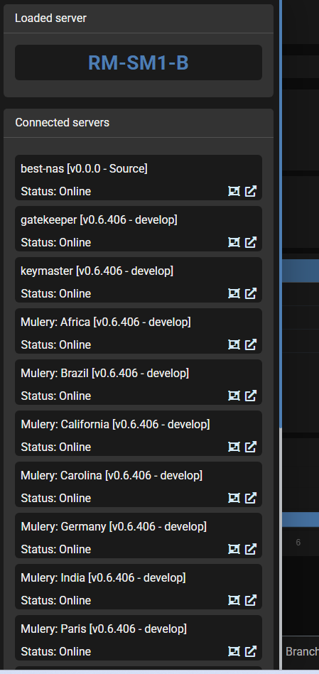
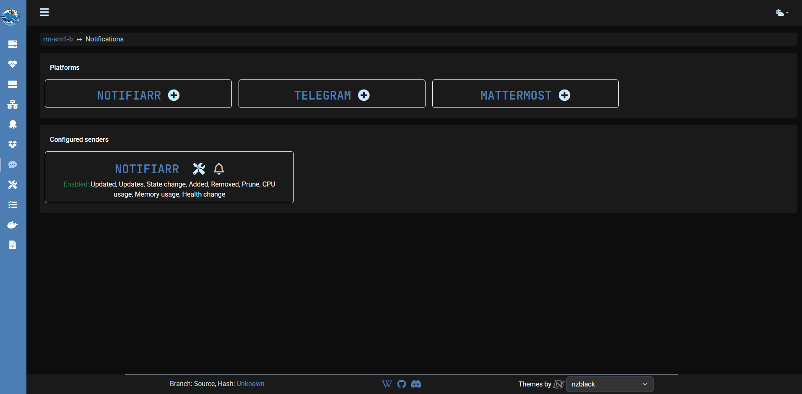

##### GitHub

&style=plastic)
&style=plastic)
&style=plastic)

##### Support

## Purpose

Simple UI driven way to manage updates & notifications for Docker containers.  

## Project support

If the project is useful for you, do us a favor and star this project on our [GitHub](https://github.com/Notifiarr/dockwatch){:target="_blank"} page!  
If you'd like to support the project financially, consider sponsoring us on the [Notifiarr Sponsors](https://github.com/sponsors/Notifiarr){:target="_blank"} page. If you use [Notifiarr](https://notifiarr.com){:target="_blank"} and link your GitHub account, you'll also receive patron perks there.

## Features or bugs

Have a bug or feature request? Join our [Discord](https://notifiarr.com/discord){:target="_blank"} and discuss it there in real time before opening a GitHub issue. We'll confirm the report or refine the request, and only move it to GitHub if necessary — many issues can be resolved quickly without creating one.

## Notification options

### Triggers

- Container (re-)created/removed
- Container state changes (running ⇾ stopped — healthy ⇾ unhealthy)
- Update for container image tag is available
- Update for container image tag has been applied
- Orphan images, volumes & networks are pruned
- Memory and CPU usage is over a set limit

### Platforms

- Mattermost
- Notifiarr
- Telegram

## Updating options

Updates are applied on a container by container basis and use cron scheduling for flexibility.

- Ignore updates
- Check for updates
- Auto update

## Other features

- Link and control multiple Dockwatch installs (other servers)
- Automatically locate and match container icons for non Unraid usage¹
- Update schedules for container image tags by a container basis
- Notifications by a container basis
- Automatically try to restart unhealthy containers
- Mass prune orphan images, volumes & networks
- Mass actions for containers [(re-)start/stop, pull, update]²
- Group containers in a table view for easier management
- Interactive shell support through Web UI
- Send shell commands on a cron schedule by a container basis 

¹ If icon is available at [Notifiarr/images](https://github.com/Notifiarr/images) 
² Also includes generating a docker run command, docker-compose.yml and comparing mounts.

## Screenshots

!!! note
    UI and screenshots may change over time; visuals and labels here might differ slightly from the current app.

### Interface

#### Servers

#### Overview

#### Containers

#### Container

#### Container compose

#### Networks

#### Compose

#### Orphans

#### Notifications

#### Settings

#### Tasks

#### Commands

#### Logs

### Notifiarr notifications

### Telegram notifications

