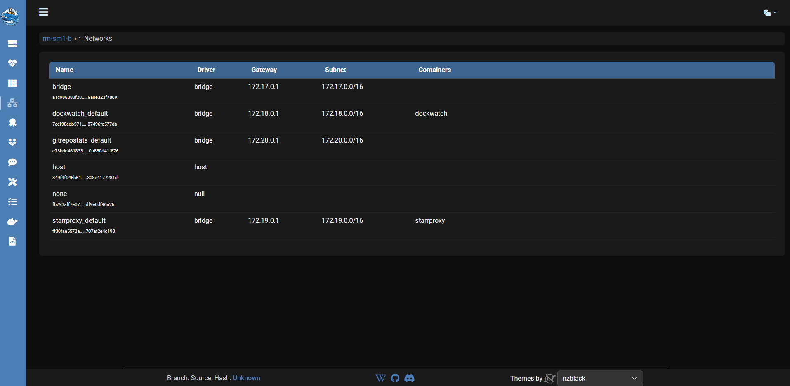
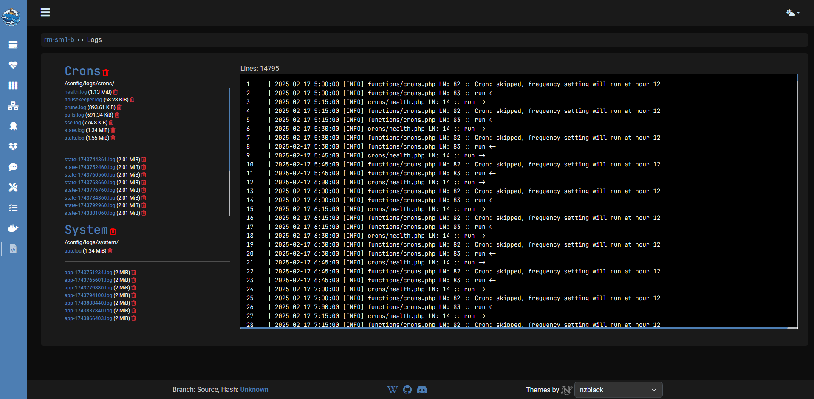

#### GitHub

&style=plastic)
&style=plastic)
&style=plastic)

#### Support

## Purpose

Simple UI driven way to manage updates & notifications for Docker containers. No external database is required, all settings are stored locally in an sqlite3 database.

## Project support

If the project is useful for you, do us a favor and smash that star button on the [Github](https://github.com/Notifiarr/dockwatch){:target="_blank"} page! If you want to support the project financially we do appreciate it and you can do that on the [Notifiarr Github](https://github.com/sponsors/Notifiarr){:target="_blank"} sponsor page. Added bonus with that is if you also use [Notifiarr](https://notifiarr.com){:target="_blank"} you can link your Github account and get patron perks there too!

## Features or bugs

If there is a feature you would like added or think you have found a bug, please join the discord and lets discuss it there in real time before doing a Github request. After we determine what to do (add a new feature or confirm the bug) we can move it to Github if necessary although most things can be fixed fast enough that it wont be needed.

## Notification options

### Triggers

- Container (re-)created/removed
- Container state changes (running -> stopped or healthy -> unhealthy)
- Update for container image tag is available
- Update for container image tag has been applied
- Orphan images, volumes & networks are pruned
- Memory and CPU usage is over a set limit

### Platforms

- Mattermost
- Notifiarr
- Telegram

## Updating options

Updates are applied on a container by container basis and use cron scheduling for flexibility

- Ignore updates
- Check for updates
- Auto update

## Other features

- Link and control multiple Dockwatch installs (other servers)
- Automatically locate and match container icons for non Unraid usage*
- Update schedules for container image tags by a container basis
- Notifications by a container basis
- Automatically try to restart unhealthy containers
- Mass prune orphan images, volumes & networks
- Mass actions for containers [(re-)start/stop, pull, update]**
- Group containers in a table view for easier management

\* If icon is available at [Notifiarr/images](https://github.com/Notifiarr/images) 
** Also includes generating a docker run command, docker-compose.yml and comparing mounts.

## Screenshots

!!! note
    These might differ slightly from time to time as the UI can change faster than the wiki might be updated.

### Interface

#### Servers

#### Overview

#### Containers

#### Container

#### Container compose

#### Networks

#### Compose

#### Orphans

#### Notifications

#### Settings

#### Tasks

#### Commands

#### Logs

### Notifiarr notifications

### Telegram notifications

